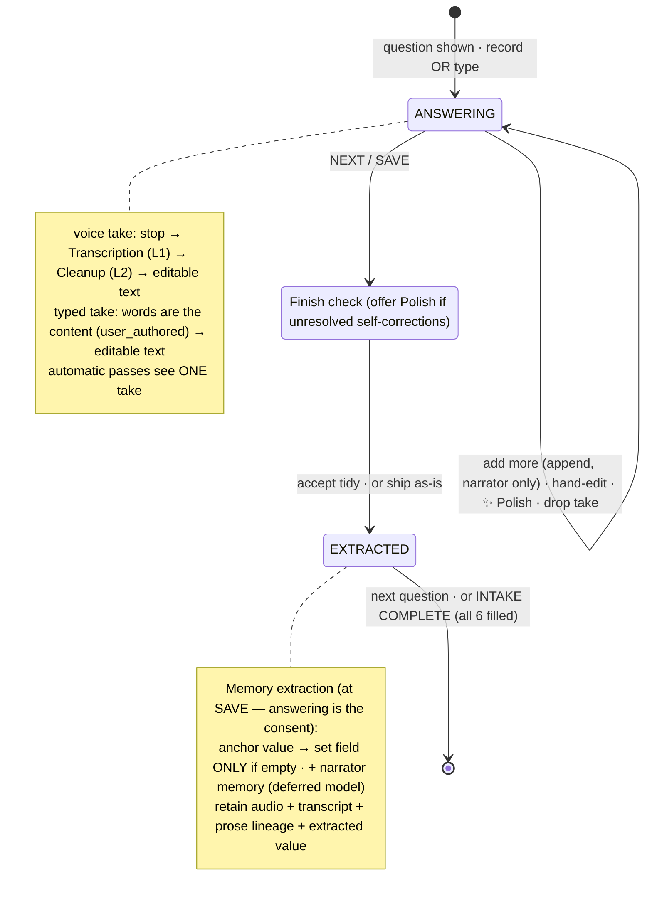
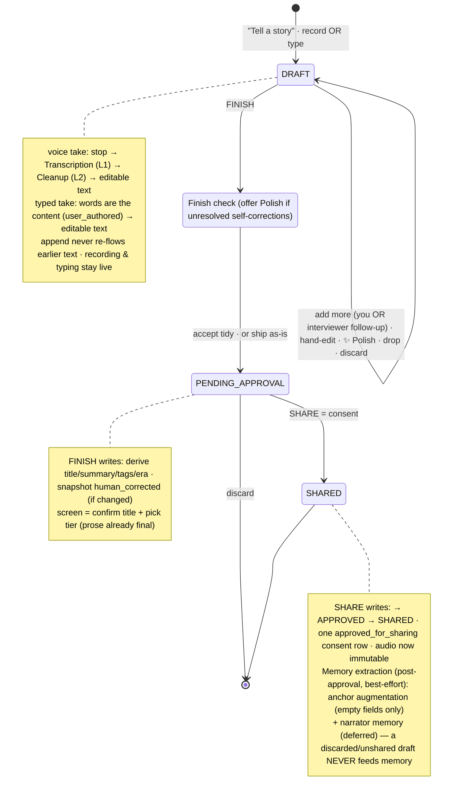
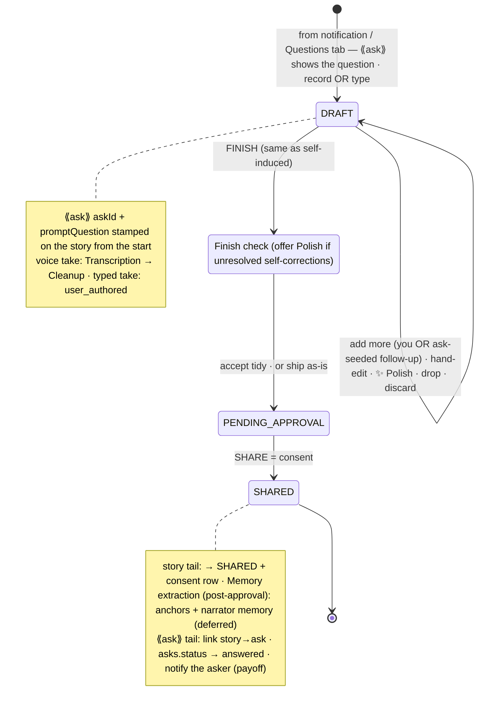

# Capture State Machines — for review (2026-07-03)

Three flows share **one composing surface** (record **or type** → [transcribe → Cleanup for voice] →
edit, with live recording/typing throughout). They differ only in the tail. **Nothing here is built
yet — this is for approval.** Rich browser version: `docs/capture-state-machines.html`. Decisions are
recorded in `CONTEXT.md` (the four text operations, the pass-scope invariant, source-of-truth vs.
audio-of-record, Draft, Intake).

## Shared operations & rules

- **Two entry types, freely interleaved in one draft** — a **voice take** (audio → `Transcription`
  L1 → `Cleanup` L2) or a **typed take** (the words are the content, L1 `user_authored`; **skips
  Transcription + Cleanup**). Any audio at all makes the story `voice`-kind (ADR-0007).
- **Automatic passes see one take only.** `Cleanup` fixes filler, false starts, and **within-take**
  self-corrections (keeps the hedge when unsure).
- **Every holistic pass is human-confirmed** — via the **✨ Polish** button *or* the **Finish check**;
  never silent. Polish de-rambles and resolves **cross-take** self-corrections. `hand-edit` is yours
  and permanent. Both are logged.
- **Audio is the permanent original record** (never discarded — playback, audit, improvement;
  immutable once consented). The **source of truth is the approved prose** — the composite of spoken +
  typed + corrected + polished input. Prose is **authored, not regenerable from audio**.
- **Retention:** all audio kept (intake included); only **Discard** / **Drop** delete. Append never
  re-touches earlier text.
- **Ledger:** every stage appends to the immutable prose lineage
  (`ai_transcribed · ai_cleaned · ai_polished · human_corrected · user_authored`).
- **Memory extraction (all modes):** mines what was said into what the system remembers — anchor
  augmentation (into empty fields) now, broader narrator memory later (deferred; seam ready). Rule:
  **audit retention is unconditional, memory extraction is consent-gated** — for a Story it fires
  **only post-approval** (a discarded/unshared draft never feeds memory); **intake** extracts at
  **Save** (answering the question is the consent). Best-effort.

---

## 1 · Intake — filling in a biographical answer

One question at a time. Same surface, but **not a Story**: no interviewer follow-ups, no audience, no
consent, never surfaced. Audio + transcript retained — intake is also the **designated first source
of narrator memory** (seam ready via retention; the memory model itself is a separate, deferred
design).

---

## 2 · Self-induced story — telling on your own initiative

No question. The full authoring flow: compose (voice and/or text), finish, choose audience, consent.

---

## 3 · Asked story — answering a question someone asked

Identical to a self-induced story **except** the ask-specific points (marked ⟪ask⟫).

---

## Confirmed decisions (this session)

- Editor lives in **DRAFT**; **Finish ≠ Share** (consent is its own tap).
- **Append never re-renders**; automatic passes see one take; every holistic pass (✨ Polish or the
  **Finish check**) is human-confirmed — never silent.
- Four operations: **Transcription → Cleanup → Polish → Correction** (enum renamed: the automatic
  light pass is `ai_cleaned`; the manual button is `ai_polished`). **Every Polish tap logged.**
- **Voice + text interleave in one draft**; typed takes skip Transcription+Cleanup; any audio ⇒
  `voice`-kind.
- **Audio = permanent original record** (never discarded); **prose = source of truth** (composite,
  authored, not regenerable from audio).
- **All audio retained** (intake included). **Intake** shares the interaction, not the authoring tail,
  and is the designated first narrator-memory source (model deferred).
- **Memory extraction in every mode**, but **consent-gated**: a Story feeds memory **only
  post-approval** (discarded/unshared drafts never do); **intake** extracts at **Save**. Audit
  retention is unconditional; memory is not. Anchor augmentation exists today; broader narrator memory
  is the deferred model.
- **FINISH derives metadata** (title/summary/tags/era); **PENDING_APPROVAL** is a light
  title+tier+Share screen.

## Consequences (captured in ADR-0014, not yet built)

- Supersedes parts of the **2026-06-29 prose-provenance** design (render-before-review, "AI runs
  once," polish-not-logged) and the **direct-story-creation** kind/CHECK model.
- The `Story.kind` **CHECK constraints** (take-0 `recording_media_id`) must move to a per-take /
  "has any recording" model (multi-take audio lives in `story_recordings`, ADR-0012).
- The pipeline **regeneration contract is now lossy**: prose must be treated as authored-and-persisted,
  **never blindly regenerated** from audio/transcript (would destroy typed takes + corrections).
