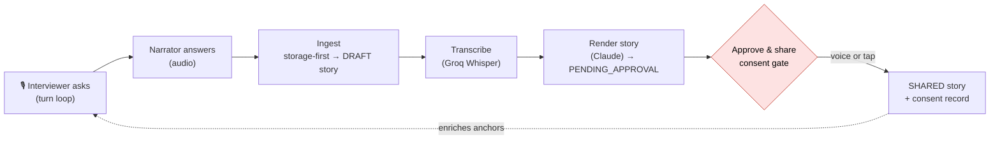
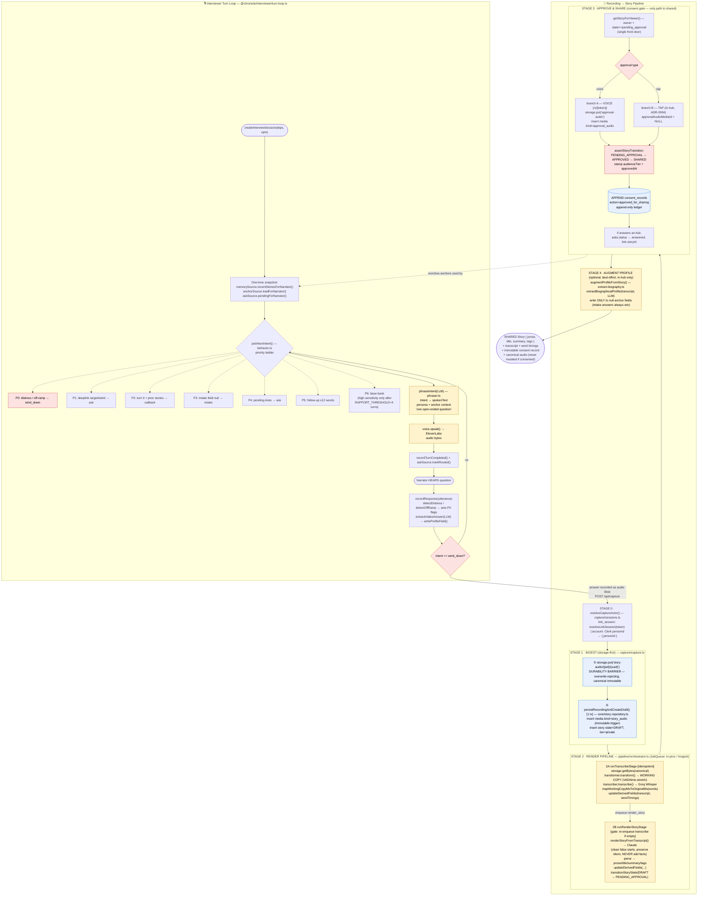

# Recording → Story Pipeline

> ⚠️ **A redesign is approved but not yet built (ADR-0014, 2026-07-03).** This document describes the
> **current shipped** flow, where `transcribe` + `render` run automatically on stop and the editor is
> a post-render `pending_approval` review. **ADR-0014 supersedes that**: the editor becomes a live
> `DRAFT` composing surface (record *or type*, per-take **Cleanup**, append, hand-edit, opt-in
> **Polish**), an explicit **Finish** derives metadata and moves to `pending_approval`, and consent
> stays a separate tap. It also reframes prose as *authored* (not regenerable from audio) and renames
> the `ai_polished` provenance level to `ai_cleaned`. For the target design see
> **`docs/Capture-State-Machines.md`** and **`docs/adr/0014-*`**. Until that lands, the flow below is
> what the code does.

How a spoken answer becomes a shared story. Two coupled flows:

- The **interviewer turn loop** (`@chronicle/interviewer`) drives *what the narrator is asked*. It never touches Story state — it only produces the question and consumes the answer's effect on biographical anchors.
- The **recording → story pipeline** (`@chronicle/capture` → `@chronicle/pipeline` → `@chronicle/core`) turns the recorded answer into a transcribed, rendered, consented, shared story.

> Source of truth is the code, not this doc. Key files: `interviewer/turn-loop.ts`, `interviewer/behavior.ts`, `capture/capture.ts`, `pipeline/orchestrator.ts`, `core/story-repository.ts`, `core/authorization.ts`. See also `docs/Phase-0-1-Engineering-Spec.md` and `docs/DECISIONS.md`.

---

## High-altitude view

The single load-bearing rule: `pending_approval → shared` is the **only** path to a visible story, it runs through `assertStoryTransition`, and it writes one immutable row to the append-only consent ledger. Canonical audio is durable before any DB row exists and is never mutated once consented.

---

## Detailed view

### Reading the detailed diagram

- **Dashed P0–P6 edges** are the priority ladder inside `pickNextIntent` — exactly one intent is chosen per turn, not a sequence of steps.
- The **`S3 -.-> SNAP` dashed edge** is the feedback coupling: a shared story (and any augmented anchors) becomes the warm-callback / de-dup material the *next* interview session loads at snapshot time.
- Color legend: 🔴 red = gates / branch points, 🔵 blue = storage & ledger writes, 🟡 yellow = LLM / vendor-seam calls.

### Invariants worth remembering

- **The two loops are decoupled.** The interviewer produces questions and steers on distress/off-ramp; it never sets Story state. The spoken answer is what enters the capture pipeline.
- **Storage-first is the durability barrier.** Audio hits the overwrite-rejecting object store *before* any DB row. Canonical bytes are never aliased forward — transcription always operates on a fresh working copy.
- **Consent is one path, recorded once.** `pending_approval → approved → shared` routed through `assertStoryTransition`; one `approved_for_sharing` row in the append-only ledger. Voice vs. tap approval differ only in whether `approvalAudioMediaId` is set.
- **Both async stages are idempotent and self-healing.** Transcribe skips if a transcript already exists; render re-enqueues transcribe if it finds none.
- **Direct intake answers win.** Post-approval biographical augmentation only writes to currently-null anchor fields.
