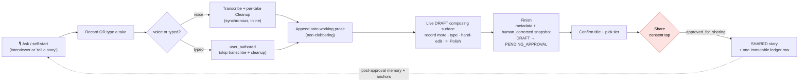
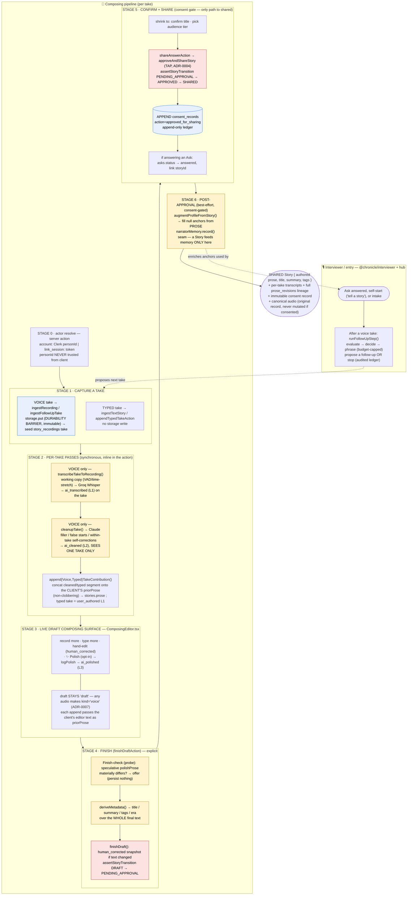

# Recording → Story Pipeline

How a spoken (or typed) answer becomes a shared story, as shipped after **ADR-0014** (the composing
surface — authored prose, per-take capture, the four passes; Increments 0–5, 2026-07-04). The old
flow — `transcribe` + `render` run automatically on stop, then a `pending_approval` review editor
behind a "Polishing your words" spinner — is **gone**. The editor is now a live `DRAFT` composing
surface; an explicit **Finish** seals it; consent stays a separate tap.

Two coupled flows:

- The **interviewer turn loop** (`@chronicle/interviewer`) drives *what the narrator is asked* — and,
  in the in-hub answer thread, whether a **follow-up** is proposed after a take. It never touches
  Story state.
- The **composing pipeline** (`@chronicle/capture` → per-take AI seams in `@chronicle/pipeline` →
  `@chronicle/core`) turns each recorded/typed take into appended, authored prose, and — at Finish
  and Share — into a sealed, consented, shared story.

> Source of truth is the code, not this doc. Key files: `apps/web/app/hub/answer/[askId]/actions.ts`
> (`recordAnswerAction` / `composeStoryAction` / `appendTypedTakeAction` / `recordFollowUpTakeAction`
> / `finishDraftAction` / `shareAnswerAction`), `apps/web/app/hub/ComposingEditor.tsx`,
> `core/story-repository.ts` (`appendVoiceTakeContribution` / `appendTypedTakeContribution` /
> `logPolish` / `finishDraft` / `approveAndShareStory`), `pipeline/render-story.ts`
> (`transcribeTakeToRecording` / `cleanupTake` / `polishProse` / `deriveMetadata`),
> `core/authorization.ts`. See also `docs/adr/0014-*`, `docs/adr/0007-*`, `docs/adr/0004-*`,
> `docs/99-pruned/phase-0-1-build/`, and `docs/engineering/DECISIONS.md`.

---

## High-altitude view

The single load-bearing rule is unchanged: **consent is the only path to a visible story.**
`pending_approval → approved → shared` runs through `assertStoryTransition` and writes exactly one
immutable `approved_for_sharing` row to the append-only consent ledger. **Finish ≠ Share** (ADR-0004):
Finish only seals composition; the audience never sees anything until the separate Share tap. The
audio is durable in the overwrite-rejecting object store before any DB row exists and is never mutated
once consented — but it is the permanent **original record**, *not* the regenerable source of the
prose (ADR-0014 §7, amends ADR-0007).

---

## Detailed view

### Reading the detailed diagram

- **Stages 1–3 repeat per take.** Each new voice or typed take runs Stage 1 → 2 and appends onto the
  *client's current editor text* (`priorProse`), never a fresh DB read — so a concurrent hand-edit is
  never clobbered. The draft stays `draft` the whole time.
- **The `S6 -.-> ENTRY` dashed edge** is the feedback coupling: a shared story's augmented anchors +
  memory become material the *next* session loads.
- **The `FUP -.-> S1` dashed edge** is proposal-only: after a voice take, the interviewer may propose
  a follow-up (fully audited in a ledger), but a broken/slow evaluator can never block the draft — it
  just means "no follow-up proposed."
- Color legend: 🔴 red = gates / transitions, 🔵 blue = storage & ledger writes, 🟡 yellow = LLM /
  vendor-seam calls.

### The four named passes (ADR-0014 §2)

| Pass | Provenance level | When | Scope |
|------|------------------|------|-------|
| **Transcription** | `ai_transcribed` | per voice take, inline | raw STT of one take |
| **Cleanup** | `ai_cleaned` | per voice take, inline (auto) | **one take only** — filler / false starts / within-take self-corrections |
| **Polish** | `ai_polished` | opt-in ✨ button, or accepted Finish-check | holistic, **human-confirmed**, cross-take |
| **Correction** | `human_corrected` | narrator hand-edit / Finish snapshot | the narrator's own words |

A typed take is `user_authored` (L1) and **skips** Transcription + Cleanup — the words are already
authored. **Every AI pass is logged** to the append-only `prose_revisions` lineage, including every
Polish tap (even one later undone).

### Intake shares the surface but is not a Story

Intake (`/hub/about-you`) uses the *same* composing surface and passes (record/type → Cleanup → edit
→ append → Polish), but **terminates at anchor extraction** — no interviewer follow-ups, no audience,
no consent, never surfaced. It is owner-only and lives behind a separate `intake_revisions` ledger
(ADR-0014 §8, Inc-4 note), never behind the content-authorization front door. Intake audio +
transcript are retained ("keep all audio" is universal); intake extracts memory **at Save**
(answering is the consent), whereas a Story extracts memory **only post-approval**.

---

## Observability

The whole record/type/edit/polish/finish/share sequence emits correlated logs (ADR-0014 Inc 5). The
2026-07-03 live hang was undiagnosable precisely because there were none.

- **Server** — `plog` / `plogError` (`@chronicle/pipeline/logger`). Every request entrypoint
  (`recordAnswerAction`, `composeStoryAction`, `appendTypedTakeAction`, `recordFollowUpTakeAction`,
  `finishDraftAction`, `shareAnswerAction`, and the **intake** path) calls `beginLogContext`, binding
  a short **correlation id (cid)** to the whole async subtree via `AsyncLocalStorage`. Every line for
  one run shares the tag `[chronicle:<scope>:<cid>]` (e.g. `[chronicle:answer:ab12cd34]`) and greps as
  a unit.
  - `CHRONICLE_PIPELINE_LOG=1` — force on (even in prod / tests; use deliberately). Default: on in
    local dev, off in production and under Vitest. `CHRONICLE_PIPELINE_LOG=0` forces off.
  - `CHRONICLE_PIPELINE_LOG_FULL=1` — log the full transcript/prose instead of a truncated,
    single-line preview. Off by default because story content is sensitive family data.
- **Client** — `clog` (`apps/web/lib/clog.ts`), one non-sensitive line per capture-state transition
  (record start/stop, take appended, follow-up proposed, polish, finish, share). Ids / kinds /
  booleans / lengths only — never prose text.
  - `NEXT_PUBLIC_CHRONICLE_CLIENT_LOG=1` — build-time env flag (read once at module load).
  - `localStorage["chronicle:clog"]="1"` — devtools flag, read at every call, so it can be flipped in
    a live (even prod) console with no rebuild.

---

### Invariants worth remembering

- **Consent is one path, recorded once.** `pending_approval → approved → shared` routes through
  `assertStoryTransition`; one immutable `approved_for_sharing` row in the append-only ledger. Tap vs.
  (legacy) voice approval differ only in whether `approvalAudioMediaId` is set (tap → NULL, ADR-0004).
- **Finish ≠ Share.** Finish seals composition (metadata + `human_corrected` snapshot + transition to
  `pending_approval`); the audience sees nothing until the separate Share tap.
- **Prose is authored, not regenerated.** `stories.prose` is a composite of spoken + typed +
  corrected + polished input, sealed at approval. It must **never** be blindly re-rendered from audio
  (that would destroy typed takes and hand-corrections). Only a voice take's raw *transcript* is
  regenerable.
- **Append is per-take and non-clobbering.** Each take's Cleanup sees one take only; the server
  concatenates onto the *client's* current editor text (`priorProse`), never a fresh DB read.
  Cross-take fixes are out of Cleanup's reach — they belong to Polish or the Finish-check, which are
  always human-confirmed.
- **Storage-first is the durability barrier.** Voice audio hits the overwrite-rejecting object store
  before any DB row; transcription always runs on a fresh working copy. Any audio at all makes the
  story `voice`-kind (ADR-0007).
- **Per-take passes are synchronous and inline.** Transcription + Cleanup run in the capture server
  action (short audio, single stage, returns the cleaned segment inline) so each take feels
  interactive. The durable Inngest queue is reserved for heavier/back-grounded work; the legacy
  link-session `/s/[token]` surface still runs the older monolithic `transcribe → render`
  orchestrator.
- **Memory is consent-gated.** A Story feeds narrator memory / anchor augmentation **only
  post-approval** — a discarded or unshared draft never does. Intake extracts at Save. Both are
  best-effort and can never fail the Share.
- **Direct intake answers win.** Post-approval biographical augmentation only writes to
  currently-null anchor fields.
